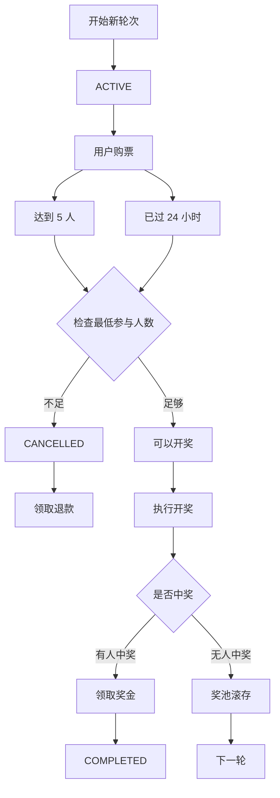
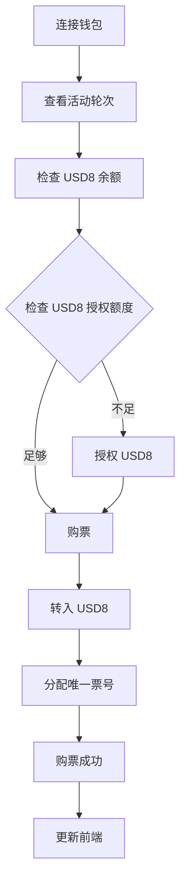
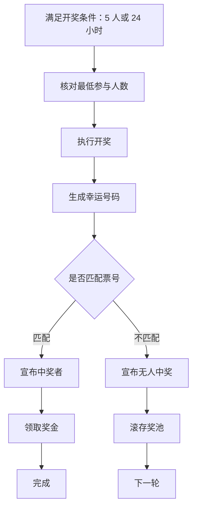
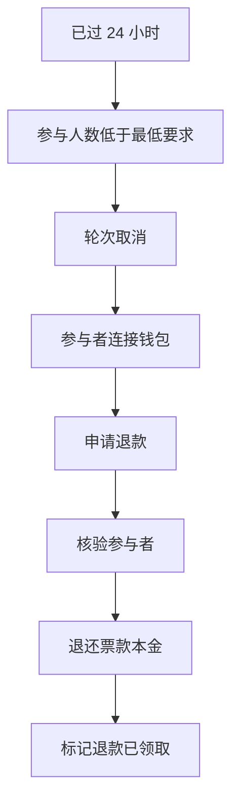

# DLottery 产品需求文档

[English](PRD.md) | [简体中文](PRD.zh-CN.md) | [文档目录](README.md)

本文为提供的英文考核需求的参考译文。需求以[英文 PRD](PRD.md)为参考，消除歧义的具体实现选择见[架构说明](architecture.zh-CN.md)。

**产品：** DLottery（去中心化抽奖）\
**文档类型：** 产品需求文档（PRD）\
**范围：** MVP

## 1. 产品总体说明与业务流程

### 1.1 产品说明

DLottery 是部署在 EVM 兼容区块链上的去中心化抽奖应用。

产品包括：

- **智能合约：** 管理轮次、购票、随机开奖结算、奖金、退款、滚存资金和 DAO 费用。
- **前端：** 提供钱包连接、购票、开奖交互、结果、退款和历史记录。
- **后端：** 作为区块链事件索引器以及历史/查询服务。
- **USD8：** 用于购买抽奖票的 ERC20 代币。

### 1.2 核心业务规则

| 项目           | 要求                           |
| -------------- | ------------------------------ |
| 支付代币       | USD8                           |
| 票价           | 10 USD8                        |
| 最大参与人数   | 每轮 5 人                      |
| 票号范围       | 1–10                           |
| 每个钱包持票数 | 每轮 1 张                      |
| 轮次时长       | 24 小时                        |
| 最低参与人数   | 可配置，例如 2 人              |
| 开奖触发条件   | 5 人参与或达到 24 小时截止时间 |
| 人数不足       | 取消本轮并允许退款             |
| 中奖者         | 票号与幸运号码一致的参与者     |
| 无人中奖       | 奖池滚入下一轮                 |
| DAO 费用       | 中奖者净利润的 5%              |

### 1.3 总体业务流程

## 2. 智能合约功能清单

智能合约是抽奖及资金状态的权威来源。

### 2.1 轮次管理

- 初始化抽奖配置。
- 创建唯一的轮次 ID。
- 开始新轮次并记录开始时间。
- 开始新轮次前，确保上一轮已完成结果结算。
- 将滚存资金带入下一轮。
- 管理轮次状态。

### 2.2 票务管理

- 接收 USD8 票款。
- 校验轮次状态和 24 小时截止时间。
- 限制最大参与人数。
- 每个钱包每轮仅允许一张票。
- 从 1–10 范围分配唯一票号。
- 防止重复票号。
- 发出购票事件。

### 2.3 抽奖结算

- 只有轮次满足结算条件后才允许开奖。
- 核对最低参与人数。
- 生成幸运号码。
- 判断是否存在票号匹配的参与者。
- 匹配时记录中奖者。
- 无匹配时将轮次标记为 `NO_WINNER`。
- 无人中奖时滚存奖池。

### 2.4 奖金与退款管理

- 仅允许中奖者领取奖金。
- 计算中奖者净利润。
- 转移 DAO 费用。
- 将剩余奖金转给中奖者。
- 仅被取消的轮次允许退款。
- 每个参与者只能领取一次票款本金退款。

### 2.5 必需的合约事件

- `DrawStarted`：轮次开始。
- `TicketBought`：购票。
- `LotteryDrawn`：开奖结果确定。
- `DrawCancelled`：轮次取消。
- `PrizeClaimed`：奖金领取。
- `RefundClaimed`：退款领取。

## 3. 后端功能清单

后端是被动的区块链索引与查询服务，不决定开奖结果，也不控制资金。

### 3.1 后端部署架构

后端采用**容器化服务**部署，并从 **Golang、Rust、Node.js** 中选择一种实现语言。语言选择属于工程决策，不论选哪一种，都应提供相同的功能和 API。

部署要求：

- 容器化部署。
- 连接区块链 RPC。
- 连接 MySQL 或 PostgreSQL。
- REST API 服务。
- 区块链事件监听器。
- 适合生产环境的日志和错误处理。

### 3.2 区块链事件监听

持续监听抽奖合约的轮次开始、购票、开奖结果、轮次取消、奖金领取及退款领取事件。

监听器必须支持：

- RPC 重连。
- 事件处理。
- 区块确认处理。
- 区块链重组保护。
- 重试和错误处理。

### 3.3 数据库同步

存储并维护以下抽奖历史字段：轮次 ID、轮次状态、开始/结束时间、票价、参与人数、幸运号码、中奖地址、总奖池、DAO 费用、中奖者奖金。

历史记录更新应保持幂等，避免重复数据。

### 3.4 后端 API

#### 当前轮次

`GET /api/v1/draws/current`

提供当前轮次信息、状态、剩余时间、参与者、票号分配及奖池。

#### 历史轮次

`GET /api/v1/draws/history`

提供分页历史记录，包括轮次 ID、状态、开始/结束时间、幸运号码、中奖者、总奖池、DAO 费用和中奖者奖金。

## 4. 前端功能清单

### 4.1 钱包

- 连接 Web3 钱包。
- 展示已连接的钱包地址。
- 展示 USD8 余额。
- 检测用户是否已经参与。
- 根据轮次状态启用或禁用操作。

### 4.2 活动轮次面板

展示当前轮次 ID、状态、票价、参与人数、剩余时间、总奖池和票号分配。票号表需显示 **1–10** 及对应钱包地址。

### 4.3 购票

前端必须依次：

1. 检查 USD8 余额。
2. 检查 USD8 授权额度。
3. 必要时请求授权。
4. 提交购票交易。
5. 展示交易状态。
6. 展示分配的票号。
7. 防止同一钱包在本轮再次购票。

### 4.4 开奖

轮次满足条件时，展示 **Perform Lottery Draw** 操作，显示简短的旋转/加载动画，等待区块链确认，并展示最终结果。

### 4.5 中奖结果

展示中奖钱包、幸运号码、总奖池、DAO 费用、中奖者可领取金额和领奖操作。

### 4.6 无人中奖结果

展示幸运号码、无人中奖结果、滚存金额，以及可用时的下一轮信息。

### 4.7 退款

被取消的轮次需显示取消状态，对符合资格的参与者显示 **Claim Refund**，展示退款交易状态，并在成功领取后禁用退款操作。

### 4.8 历史记录

展示历史轮次 ID、状态、时间、幸运号码、中奖者、总奖池、DAO 费用及中奖者奖金。

## 5. 核心流程图与公式

### 5.1 购票流程

### 5.2 开奖与结算流程

该图对应英文 PRD 的开奖分支；人数不足的取消路径见总体流程和退款流程。

### 5.3 退款流程

### 5.4 中奖者净利润

变量：

- **T**：票价。
- **N**：参与人数。
- **R**：滚存金额。
- **P_total**：总奖池。

总奖池：**P_total = R + (N × T)**。

计算 DAO 费用时排除中奖者原始票款本金：**Net Profit = P_total − T**。

### 5.5 DAO 费用

DAO 费用为中奖者净利润的 **5%**：

**DAO Fee = max(0, Net Profit × 5%)**

中奖者可领取金额：

**Winner Claimable = P_total − DAO Fee**

也可以写为：

**Winner Claimable = T + (Net Profit × 95%)**

#### 示例

假设滚存 20 USD8，参与者 5 人，每张票 10 USD8：

- 总奖池 = 20 + (5 × 10) = **70 USD8**。
- 中奖者净利润 = 70 − 10 = **60 USD8**。
- DAO 费用 = 60 × 5% = **3 USD8**。
- 中奖者可领取 = 70 − 3 = **67 USD8**。

因此，**中奖者获得 67 USD8，DAO 获得 3 USD8**。
