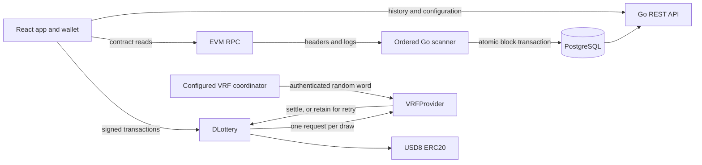

# Architecture and implementation decisions

The [PRD](PRD.md) controls business behavior. This repository adapts the lottery UI/domain ideas from the supplied Solana projects and the EVM wallet/indexing practices from `evm_consumer` and `bsc_prediction_market`. The implementation here is self-contained and does not import runtime code from those directories.

## Components and trust boundaries



The contract owns lottery and money state. The indexer is a passive observer. Browser writes use a signer from the connected wallet; API queries do not construct or submit unsigned transactions. Deployer credentials never enter backend or frontend configuration.

## Contract state and money

Stored states: `ACTIVE → DRAWING → WINNER_DECLARED → COMPLETED`, `DRAWING → NO_WINNER`, and `ACTIVE → CANCELLED`. Readiness to draw is derived from participant count and block timestamp. The fifth ticket closes entry; an explicit `performDraw` transaction requests randomness or cancels after an insufficient-quorum timeout. The 24-hour deadline is fixed; local tests advance the chain clock.

Each round has a monotonically increasing uint256 ID, immutable-for-deployment settings, start/deadline/finalization timestamps, ten ticket owner slots, and its own result and claim state. `startDraw(expectedPreviousId)` and other actions reject stale IDs. Numbers 1–5 are assigned in order; the winning number is `(word % 10) + 1`. Assigning tickets sequentially does not change any participant's chance of matching that random number.

Accounting buckets are independent:

```text
liabilities = activePool + pendingRollover + outstandingPrizes + outstandingRefunds
contract balance >= liabilities
```

`outstandingPrizes` includes unpaid winner amounts and DAO fees. The historical round's original pool is metadata once it has moved into a different bucket. Direct USD8 transfers are surplus and do not increase any round's prize pool.

At settlement with a winner:

```text
pool = inheritedRollover + participants * ticketPrice
DAO fee = floor((pool - ticketPrice) * 500 / 10_000)
winnerPrize = pool - DAO fee
```

`Math.mulDiv` avoids intermediate multiplication overflow. On cancellation, current ticket payments become refund liabilities while inherited rollover becomes pending rollover. On no-winner settlement, the entire pool becomes pending rollover. Starting the next round consumes pending rollover exactly once.

The winner claims once and receives the prize in the same transaction that transfers the DAO fee. Participants claim cancelled ticket principals once. SafeERC20, reentrancy guards and revert semantics prevent partial payouts and preserve retryability after transfer failure. A conventional non-rebasing, non-taxed ERC20 is required; purchases check the exact received amount. A token whose issuer can later freeze transfers can still interrupt claims, so token selection is part of deployment configuration.

## Verifiable randomness

`VRFProvider` uses the official VRF v2.5 request interface and client encoding. Its coordinator, subscription, key hash, confirmation count, callback gas and payment mode are immutable. Only the configurator may bind the lottery, once. The callback checks `msg.sender` against the immutable coordinator; there is no coordinator-migration or administrator result override.

This deliberately implements the small coordinator authentication check directly rather than inheriting the provider library's owner-migratable coordinator base. The three unmodified vendored interface/client dependency files retain their license identifiers and provenance in `contracts/src/vendor/chainlink/NOTICE.md`.

Fulfillment first stores the word. It then attempts the bounded lottery callback; if downstream execution fails, the word remains available through `deliver(requestId)` or the lottery's `finalizeDraw(drawId)`. A repeated callback cannot overwrite the original word. There is no re-request/cancellation route. Unknown or stale authenticated callbacks are harmless, and settlement makes no token calls.

The request-ID, frozen-input and callback recovery design follows [Chainlink's VRF security guidance](https://docs.chain.link/vrf/v2-5/security). Network-specific setup and callback gas must be verified against the chosen coordinator and subscription. If the provider never fulfills, the round remains pending and the operator must recover that original request through provider funding/support; the code does not substitute another source of randomness.

## Durable indexing

The Go indexer processes only its deployment identity (`chainId:lotteryAddress`). It scans from the deployment block up to `observedHead - confirmations`. RPC calls are bounded to one block, avoiding variable provider log-range limits. Polling has timeouts, capped exponential retry delays, and context cancellation. A WebSocket connection is unnecessary for correctness or reconnection.

Each block is ordered by transaction/log index and committed in one SQL transaction containing its header, raw decoded events, draw/ticket/claim projections and contiguous cursor. Empty blocks are recorded too. Any decode, projection or database failure aborts the whole block and leaves the cursor unchanged. Duplicate canonical logs and repeated block delivery do not increment totals again. A held PostgreSQL advisory lock permits only one writer per deployment.

The cursor's canonical header hash is checked before extension, including during idle polling, restart and a lower reported chain head. On mismatch, the scanner finds the common ancestor, deletes orphaned events/headers, rebuilds projections from retained canonical events and rewinds the cursor atomically. All events are retained in MVP, so a deep reorg can rebuild from the deployment boundary. API reads use repeatable-read snapshots; recovery returns temporary unavailability rather than exposing mixed projections.

One ordered writer and full replay favor clarity at this application's scale. A high-volume service would add batching/checkpoints, retention rules, and a migration strategy for projection versions. Those are not required for five participants per round.

## API and browser consistency

Amounts and uint256 IDs remain decimal strings through SQL, JSON and browser bigint arithmetic. Times come from canonical block headers. `startTime`, `deadline` and `finalizedAt` are distinct. Winner amounts/fees owed are distinct from claimed/paid flags and amounts.

The API exposes indexed height/hash, observed height, chain time and a synchronization flag. Its countdown represents the indexed chain timestamp. The browser reads a single identified latest block for its selected round and estimates the visual countdown between refreshes. Eligibility is rechecked on-chain before a draw or purchase; the contract remains the final authority.

The frontend handles allowance/approval, pending receipts, replaced or rejected transactions, wrong networks and account switches. Current state comes from contract reads, while history is paginated through the API. Historical detail supports old claims after newer rounds start. Received-but-not-delivered randomness can be retried from the draw card.
