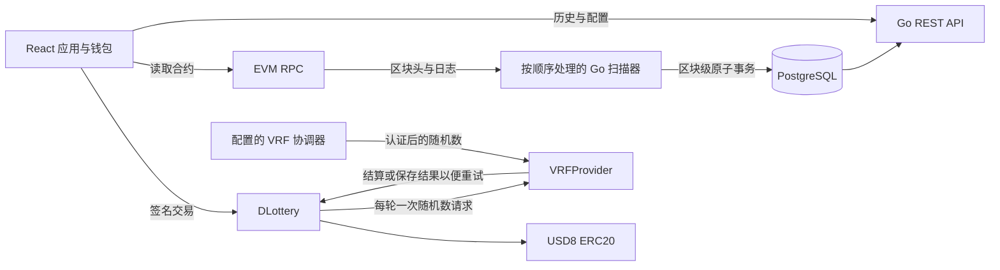

# 架构与实现决策

[English](architecture.md) | [简体中文](architecture.zh-CN.md) | [文档目录](README.md)

业务行为以 [PRD](PRD.zh-CN.md) 为依据。本项目参考了提供的 Solana 项目的抽奖界面与领域思路，以及 `evm_consumer` 和 `bsc_prediction_market` 的 EVM 钱包与索引实践。此处实现是独立的，不从这些目录引入运行时代码。

## 组件与权限边界



抽奖和资金状态由合约掌握，索引器只是被动观察者。浏览器写交易使用已连接钱包的签名者；API 查询不构建、不提交待签名交易。部署凭据不进入前端或后端配置。

## 合约状态与资金

存储的状态转换包括 `ACTIVE → DRAWING → WINNER_DECLARED → COMPLETED`、`DRAWING → NO_WINNER` 和 `ACTIVE → CANCELLED`。是否可以开奖由参与人数与区块时间计算。第五张票售出后停止购票；仍需显式调用 `performDraw` 请求随机数，或在到期且最低人数不足时取消。24 小时截止时间固定，本地测试通过推进本地链时间覆盖边界。

每轮有单调递增的 uint256 ID、在此次部署中不可变的设置、开始/截止/结果确定时间、十个票号地址槽，以及独立的结果与领取状态。`startDraw(expectedPreviousId)` 和其他操作会拒绝过期 ID。票号 1–5 按顺序分配，幸运号码为 `(word % 10) + 1`；顺序分配不改变每张票匹配随机号码的机会。

资金负债分开记账：

```text
liabilities = activePool + pendingRollover + outstandingPrizes + outstandingRefunds
contract balance >= liabilities
```

即总负债等于活动奖池、待滚存资金、未领取奖金和未领取退款之和，合约代币余额不得低于总负债。`outstandingPrizes` 包含尚未支付的中奖金额和 DAO 费用。资金转入其他分类后，历史轮次中的原奖池只是记录信息。直接向合约转入 USD8 形成额外余额，不增加任何轮次奖池。

有人中奖时：

```text
pool = inheritedRollover + participants * ticketPrice
DAO fee = floor((pool - ticketPrice) * 500 / 10_000)
winnerPrize = pool - DAO fee
```

使用 `Math.mulDiv` 避免中间乘法溢出。取消时，本轮票款变为退款负债，继承的滚存资金重新变为待滚存资金。无人中奖时，整个奖池进入待滚存分类。新轮次只能消耗同一笔待滚存资金一次。

中奖者只能领取一次；支付奖金和转移 DAO 费用在同一笔交易内完成。被取消轮次的参与者只能领取一次票款本金。SafeERC20、重入保护和回滚机制防止部分支付，并让失败的转账可以重试。要求使用不重基、不扣转账税的常规 ERC20，购票会检查实际收到的精确金额。若代币发行方可在之后冻结转账，仍可能影响领奖，因此代币选择是部署配置的一部分。

## 可验证随机数

`VRFProvider` 使用官方 VRF v2.5 请求接口和客户端编码。协调器、订阅、key hash、确认数、回调 gas 和付款模式都不可变。只有配置者可以绑定抽奖合约，而且只能绑定一次。回调将 `msg.sender` 与不可变协调器核对；不支持迁移协调器或管理员覆盖结果。

这里直接实现了精简的协调器身份校验，没有继承允许所有者迁移协调器的基类。三个未经修改的第三方接口/客户端文件保留许可证标识与原文，来源见 `contracts/src/vendor/chainlink/NOTICE.md`。

回调先保存随机数，再尝试调用抽奖合约；若下游执行失败，已保存的随机数可通过 `deliver(requestId)` 或抽奖合约的 `finalizeDraw(drawId)` 重新发送。重复回调不能覆盖原随机数。系统不提供重新请求或取消随机请求的通道；通过身份认证但未知或过期的回调不会改变结果，结算过程不调用代币合约。

请求 ID、锁定输入和回调恢复设计参考 [Chainlink VRF 安全指南](https://docs.chain.link/vrf/v2-5/security)。网络配置和回调 gas 必须与实际协调器及订阅相符。如果服务始终不回调，轮次保持等待，维护者应通过补充订阅资金或提供方支持恢复原请求；代码不会改用其他随机源。

## 持久化索引

Go 索引器只处理当前部署身份 `chainId:lotteryAddress`，从部署区块扫描到 `observedHead - confirmations`。RPC 每次只请求一个区块，避免不同服务商的日志区间限制。轮询支持超时、有限指数退避和上下文取消；正确性与重连不依赖 WebSocket。

每个区块按交易序号和日志序号排序，在单个 SQL 事务中提交区块头、解码事件、轮次/票号/领取投影和连续游标。空区块也会记录。任何解码、投影或数据库错误都会撤销整个区块的操作，保持原游标不变。重复日志和重复区块不会重复增加金额或人数。PostgreSQL advisory lock 确保每个部署只有一个写入者。

扩展游标前会核对已记录区块头的规范链哈希，包括空闲轮询、重启或 RPC 报告较低链头的情况。发现不一致后，扫描器定位共同祖先，删除孤立事件和区块头，使用保留的规范事件重建投影，并原子回退游标。MVP 保留全部事件，因此深度重组也能从部署边界重建。API 使用可重复读快照；恢复期间返回暂时不可用，不暴露混杂的新旧投影。

单个有序写入者和完整重放优先保证当前规模下的清晰性。高流量系统可进一步引入批处理、检查点、保留策略和投影版本迁移；每轮最多五人的场景不需要这些扩展。

## API 与浏览器一致性

金额和 uint256 ID 在 SQL、JSON 与浏览器 BigInt 中保持十进制字符串精度。时间来自规范区块头，区分 `startTime`、`deadline` 与 `finalizedAt`。应付奖金/费用与是否已经领取/支付分别记录。

API 返回已索引区块高度/哈希、观察到的链头、链上时间及同步标志。API 倒计时以已索引的时间为基础。浏览器在一个明确的最新区块上读取所选轮次，在刷新间隔内估算视觉倒计时。购票或开奖前再次读取链上资格，最终仍由合约裁定。

前端处理额度授权、等待回执、交易替换或拒绝、错误网络及账户切换。当前状态来自合约，历史通过 API 分页获取。历史详情允许在新轮次开始后领取旧奖金或退款。已收到但未成功送达的随机结果，可从轮次卡片重试发送。
